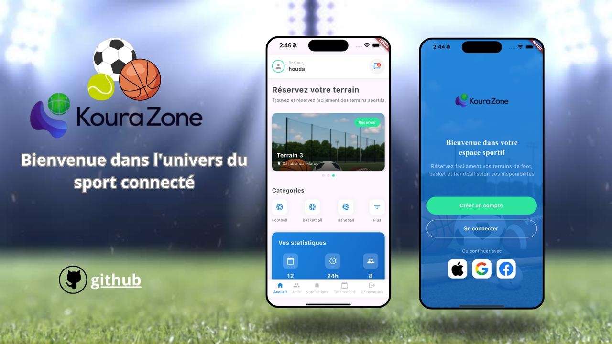

# Play Match Reservation

This repository contains a complete solution for managing sports facility reservations and match organization. It includes both a Laravel API backend and a Flutter mobile application frontend.

## Project Structure

- **laravel-api/**: Laravel backend API for authentication, reservations, matches, teams, and more.
- **flutter_app/**: Flutter mobile app for users to browse facilities, book matches, receive notifications, and manage profiles.

## Features

### Laravel API
- User authentication and registration
- Sport facility management
- Match creation and invitations
- Reservation system
- Notification system
- RESTful endpoints for all resources

### Flutter App
- User-friendly interface for booking and managing matches
- Push notifications for invitations and updates
- Profile and team management
- Facility browsing and filtering

## Getting Started

### Backend (Laravel)
1. Navigate to `laravel-api/`
2. Install dependencies: `composer install`
3. Copy `.env.example` to `.env` and configure your environment variables
4. Run migrations: `php artisan migrate --seed`
5. Start the server: `php artisan serve`

### Frontend (Flutter)
1. Navigate to `flutter_app/`
2. Install dependencies: `flutter pub get`
3. Run the app: `flutter run`